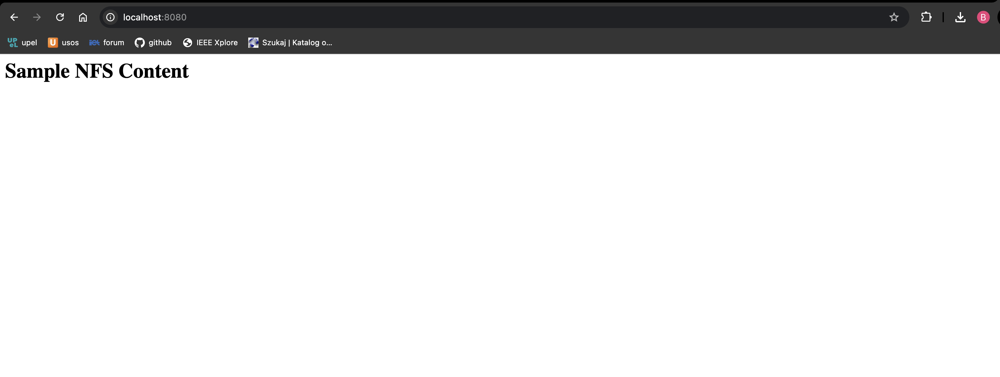

## Used commands:

```bash
aws eks create-cluster --region us-east-1 --name lsc-lab5-cluster --kubernetes-version 1.30 \
   --role-arn arn:aws:iam::862440827739:role/LabRole \
   --resources-vpc-config subnetIds=subnet-0eda7c1c21a8ffea0,subnet-0a9d01666c5617904,securityGroupIds=sg-0a8fa44097ae8b7cd

aws eks create-nodegroup \
    --cluster-name lsc-lab5-cluster \
    --nodegroup-name lsc-lab5-ng \
    --node-role arn:aws:iam::862440827739:role/LabRole \
    --subnets "subnet-0eda7c1c21a8ffea0" "subnet-0a9d01666c5617904" \
    --scaling-config minSize=3,maxSize=3,desiredSize=3 \
    --capacity-type ON_DEMAND \
    --instance-types 't2.micro' \
    --disk-size 20 \
    --region us-east-1

helm install nfs-server-provisioner charts/nfs-server-provisioner --set storageClass.name=nfs-storage

kubectl apply -f pvc.yaml

kubectl apply -f deployment.yaml

kubectl apply -f service.yaml

kubectl apply -f job.yaml

kubectl port-forward svc/nginx-service 8080:80
```

